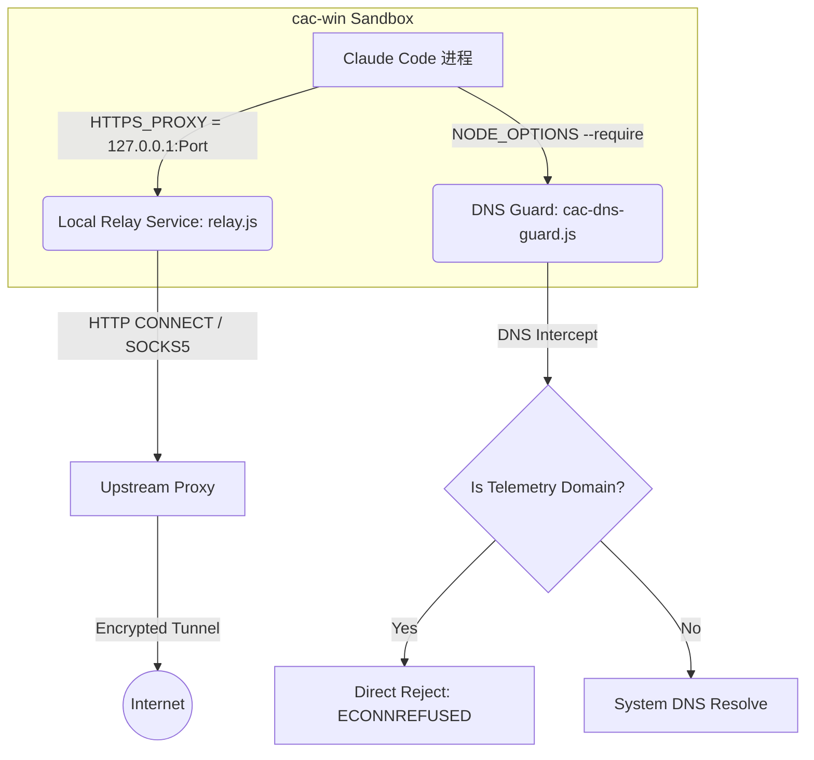

# Claude Code 与 cac-win 代理环境机制及隔离安全深度剖析

本篇文档对 Claude Code 官方的原生代理设计、开源管理器 `cac-win` 的虚拟环境隔离架构进行深入剖析，并从 DNS 泄露、CA 证书拦截、子进程行为等维度评估网络防泄漏的安全性。

---

## 一、 Claude Code 官方的原生代理设计

Claude Code 在设计之初就原生且完整地支持了标准网络代理配置。

### 1. 代理感知与检测逻辑
在 [src/utils/proxy.ts](file:///D:/Projects/claude-code/src/utils/proxy.ts) 中，核心函数 `getProxyUrl` 会自动扫描当前进程的 `process.env`：
```typescript
export function getProxyUrl(env: EnvLike = process.env): string | undefined {
  return env.https_proxy || env.HTTPS_PROXY || env.http_proxy || env.HTTP_PROXY
}
```
其环境变量的优先级为：`https_proxy` > `HTTPS_PROXY` > `http_proxy` > `HTTP_PROXY`。

同时，它支持通过 `no_proxy` / `NO_PROXY` 设定无需走代理的本地或内网域名，支持精确匹配、IP段、带端口匹配以及子域名通配符（如 `.example.com`），相关判断逻辑实现在 `shouldBypassProxy` 函数中。

### 2. 全局客户端适配
为确保无论使用何种网络库，都能统一接入代理，Claude Code 在初始化阶段会调用 `configureGlobalAgents`。它会将解析到的代理配置注入到以下四种通信信道：
1. **Axios**：用于第三方 API 兼容层及旧版 HTTP 客户端，通过 Axios 的请求拦截器和 `https-proxy-agent` 绑定代理。
2. **Undici (Native Fetch)**：用于原生 `fetch` 请求。它使用 `undici.EnvHttpProxyAgent` 设置全局 Dispatcher，并且能在代理建连和直连回退时自动处理 mTLS 及自定义 CA 证书。
3. **Bun Native WebSockets / Fetch**：如果在 Bun 运行环境下，它会自动使用相应的 `proxy` 字符串配置。
4. **AWS SDK Client**：在构造 AWS 客户端时，动态调用 `getAWSClientProxyConfig` 返回支持 `NodeHttpHandler` 的代理实例。

### 3. Status/Settings 页面呈现
在 REPL 或设置状态页面中，页面会调用 [src/utils/status.tsx](file:///D:/Projects/claude-code/src/utils/status.tsx) 收集当前环境属性：
```typescript
const proxyUrl = getProxyUrl();
if (proxyUrl) {
  properties.push({
    label: 'Proxy',
    value: proxyUrl,
  });
}
```
当你在启动时给 Node.js 进程注入了代理环境变量，该代理 URL 就会直接在 Status 面板的 `Proxy:` 字段中被直观列出。

---

## 二、 cac-win 虚拟环境的代理注入与隔离原理

`cac-win` 作为一个多环境指纹防关联的管理器，其对代理的注入相比官方设计更为严苛，采用的是**本地中转拦截**与**进程 Hook 劫持**的组合架构。



### 1. 本地中转代理 (Relay.js)
当我们在 `cac-win` 的虚拟环境中配置了代理时，管理器不会把真实的外网代理地址直接交给 Claude，而是在后台拉起一个监听在本地回环地址（如 `127.0.0.1:18000`）的中转代理：
* 文件位置：[relay.js](file:///D:/Projects/cac-win/relay.js)
* 作用：它作为本地 HTTP 代理服务，负责接收 Claude 的连接，支持在向上游转发时适配原生的 HTTP CONNECT 或加密的 SOCKS5 代理。

### 2. 环境变量劫持与 Fail-Closed（故障关闭）设计
在启动包装脚本 [src/templates.sh](file:///D:/Projects/cac-win/src/templates.sh) 中，环境变量被强行导向本地中转：
```bash
export HTTPS_PROXY="http://127.0.0.1:$_relay_port"
export HTTP_PROXY="http://127.0.0.1:$_relay_port"
```
* **防泄露效果**：这是一种 **Fail-Closed（故障关闭）** 的防御策略。如果后台的中转进程 `relay.js` 意外死亡或端口被占用，由于 `HTTPS_PROXY` 指向了一个处于关闭状态的本地端口，所有的 API 请求会当场报错（Connection Refused）并彻底断网，**绝对不会降级为本地原网直连**。这大大降低了 Anthropic 官方收到用户真实原生 IP 的概率。

### 3. DNS-Guard (cac-dns-guard.js) 拦截
通过 `NODE_OPTIONS="--require ..."`，管理器在进程启动时强行预加载了 [cac-dns-guard.js](file:///D:/Projects/cac-win/cac-dns-guard.js)。它在进程内部的几大行为确保了隐私安全：
* **DNS 级强力阻断**：它拦截了 Node.js 进程底层的 `dns.lookup`、`dns.resolve` 等 API。一旦解析的目标属于遥测域名（如 `statsig.anthropic.com`、`sentry.io`、`cdn.growthbook.io` 等），它会在尚未向系统外网 DNS 发起请求之前，就在进程内直接抛出 `ECONNREFUSED`。这完全杜绝了这部分遥测域名的本地 DNS 查询记录泄露。
* **双重兜底**：除了 DNS，它还劫持了 `net.connect` 和 `net.createConnection`，即使某些库使用缓存的 IP 直接连接遥测域名，也会在 Socket 握手阶段被强行挂断。
* **伪造健康检查**：Claude 启动时会测试连通性 `https://api.anthropic.com/api/hello`。为了防止未配置代理时直接暴露 TLS 指纹或因网络受限超时报错，`dns-guard` 拦截了此特定的 GET 请求，直接在 Node 内部伪造并返回了 `200 OK` 响应，完全没有产生出网流量。

---

## 三、 网络安全深层分析：DNS 泄露与代理端解析

即便拥有上述防护，在特定配置下仍有潜在泄露原生 IP 的风险。最显著的例子是 **DNS 泄露**。

### 1. 泄露的机制
* **当 `CLAUDE_CODE_PROXY_RESOLVES_HOSTS` 未开启时（默认状态）**：
  Node.js 的 `https-proxy-agent` 在建立 HTTPS 隧道前，可能会在本地发起 DNS 请求，试图将 `api.anthropic.com` 解析成 IP 地址。
  * **隐私影响**：尽管你传输的内容和后续 TCP 握手都走代理，但本地的 DNS 请求是以**明文**形式发送给你本地的网络运营商（ISP）或默认的局域网 DNS 网关。因此，运营商和中间节点能清晰得知你正在访问 Claude。
  * **Claude 官方会知道吗？**：在这个阶段，Claude 官方完全不知道你发起了解析。只有后续在握手阶段，如果你的网络请求直接直连了，Claude 官方才会看到你的原生 IP。如果后续流量走了代理，Claude 官方只知道代理的 IP。

### 2. 开启 `CLAUDE_CODE_PROXY_RESOLVES_HOSTS` 后的效果
一旦该环境变量被设置为 `1` 或 `true`：
* Claude Code 会强制重写代理 Agent 的 `lookup` 方法，直接将原始的域名（如 `api.anthropic.com`）发送给代理服务器（即在 HTTPS 代理握手中发送 `CONNECT api.anthropic.com:443`）。
* 本地不会产生任何针对 `api.anthropic.com` 的系统 DNS 解析请求，域名解析完全委托给远端代理服务器去执行，从而**彻底解决本地 DNS 泄露风险**。
* **注意**：`cac-win` 默认并没有在虚拟环境脚本中为你开启这个选项，用户需要手动修改或临时导出来开启。

---

## 四、 SSL/TLS 安全认证与 CA 证书注入

在 `cac-win` 中，`NODE_EXTRA_CA_CERTS` 同样扮演了核心安全角色。

### 1. 什么是 `NODE_EXTRA_CA_CERTS`？
Node.js 发起 HTTPS 连接时，不会自动读取 Windows 证书管理器或 macOS Keychain 的系统根证书库，而是只信任自身内置的 Mozilla 根证书库。
当你处于有解密/审查性质的 HTTPS 代理环境时，由于代理需要扮演中间人解密内容，它会给你发出一张由代理自签发的假证书。Node.js 检测到该证书不在其内置的信任根内，就会报错并挂断连接（如自签名证书错误）。而使用 `NODE_EXTRA_CA_CERTS` 环境变量可以向 Node.js 追加信任的 CA 证书，使网络能够正常建立。

### 2. `cac-win` 中 `ca-certs` 的含义
`cac-win` 专门生成了一套自签 CA 证书并在启动时自动配置：
```bash
[[ -f "$CAC_DIR/ca/ca_cert.pem" ]] && export NODE_EXTRA_CA_CERTS="$(_native_path "$CAC_DIR/ca/ca_cert.pem")"
```
其目的是：
1. **双向 TLS 认证 (mTLS) 信任**：在管理器与各虚拟环境的多开进程中，会使用由自签 CA 签发的客户端证书，因此 Claude Code 必须信任此 CA 才能顺利完成环境内的身份认证校验。
2. **支持 MITM 解密/抓包审计模式**：当你使用 [mitm/claude-mitm.sh](file:///D:/Projects/cac-win/mitm/claude-mitm.sh) 时，系统会在本地利用该证书解密并审计 Claude 的所有入网和出网数据。为了不让 Claude 进程报错，就需要借由 `NODE_EXTRA_CA_CERTS` 来将该 CA 证书临时注入 Claude 自身的信任名单中。

---

## 五、 全景防泄漏评估与使用建议

虽然环境变量注入（`cac-win` 默认策略）能解决绝大部分由 Claude 自身发出的核心流量泄露，但它无法防御“不遵循环境变量”的子进程。

| 安全维度 | 仅依赖 `cac-win` 默认环境变量 | 物理网卡全局代理 (TUN / 软路由) | 开启 `PROXY_RESOLVES_HOSTS` |
| :--- | :--- | :--- | :--- |
| **Claude API 请求隐私** | 🟢 **安全** (经 `relay.js` 中转加密) | 🟢 **安全** (直接由网卡分流) | 🟢 **安全** |
| **已知遥测域名数据阻断** | 🟢 **阻断** (已被 `dns-guard` 拦截) | 🟢 **阻断** | 🟢 **阻断** |
| **子进程与不遵循代理的 CLI** | 🔴 **泄露** (部分命令绕过代理直连) | 🟢 **安全** (强制路由物理拦截) | 🔴 **泄露** |
| **第三方本地 MCP 插件网络** | ⚠️ **高风险** (取决于 MCP 客户端编写) | 🟢 **安全** (网卡级截获) | ⚠️ **高风险** |
| **本地 DNS 解析泄露** | ⚠️ **有风险** (本地解析正常域名) | ⚠️ **视客户端 DNS 分流策略而定** | 🟢 **防泄露** (委托代以前解析) |

### 💡 最佳安全使用建议

为了确保你使用 Claude Code 和虚拟环境时，真实的原生 IP 以及网络访问行为不会发生任何泄露，建议采用以下配置：

1. **手动为 `cac-win` 开启代理端 DNS 解析**：
   在终端执行 `export CLAUDE_CODE_PROXY_RESOLVES_HOSTS=1`，或者在你的环境包装脚本 `~/.cac/envs/<env_name>/bin/claude` 内的 `export HTTPS_PROXY` 同级位置，永久追加一行：
   ```bash
   export CLAUDE_CODE_PROXY_RESOLVES_HOSTS=1
   ```
2. **配合系统全局代理 (TUN 网卡分流)**：
   运行复杂的终端命令或启用不受信的第三方 MCP 插件时，请务必在外部代理软件（如 Clash, Sing-Box）中开启 TUN 模式或使用全局虚拟网卡接管系统。这可以强制让那些无视环境变量的子进程流量也必须经过代理出网，确保网络层隐私滴水不漏。
